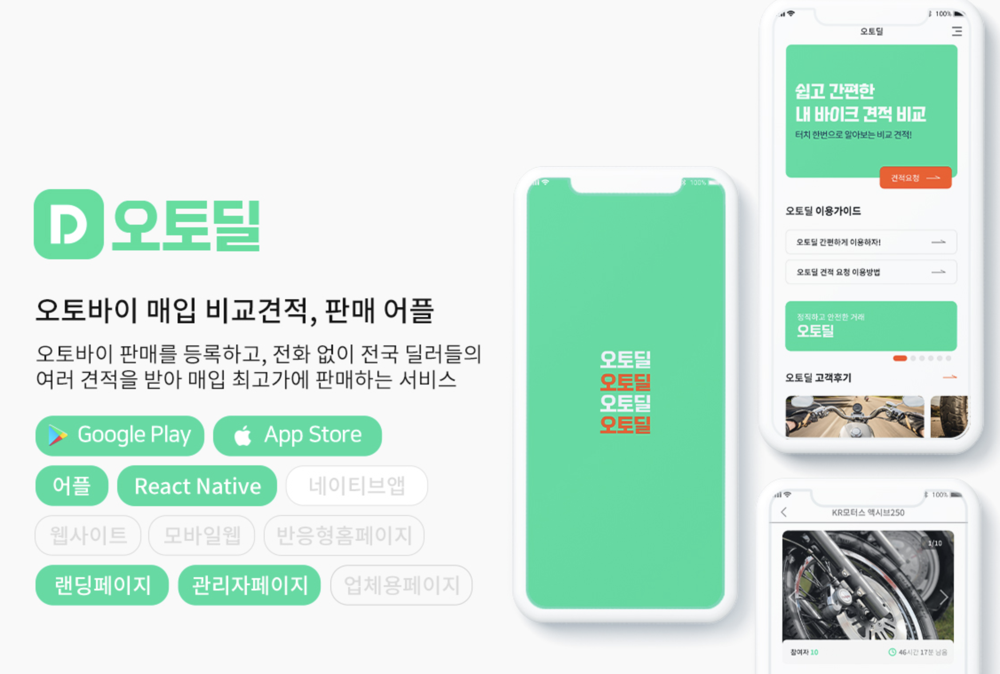

## 
Dmonster

 

## 
Project

 
<table border="1">
  <tr style="width:100%; ">
      <td align='center'style="width:33%;padding:1%;">오토바이 중개 플랫폼 오토딜</td>
      <td align='center'style="width:33%;padding:1%;">이성과의 달달한 채팅 세련된 채팅 어플 달톡</td>
      <td align='center'style="width:33%;padding:1%;">LH · SH 전세 임대 주택 거래 & 중개 어플  LH전세 다모여  (react-native front-end 참여)
      </td>
  </tr>
  <tr style="width:100%; ">
      <td align='center'style="width:33%; padding:0% 1%; justify-content: center;align-items: center; ">
      
      </td>
      <td align='center'style="width:33%; padding:0% 1%; justify-content: center;align-items: center; ">
        
        &nbsp;
      </td>
      <td align='center'style="width:33%; padding:0% 1%; justify-content: center;align-items: center; ">
        
        &nbsp;
      </td>
 
  
  </tr>
  
</table>

 

---

### 진행중
