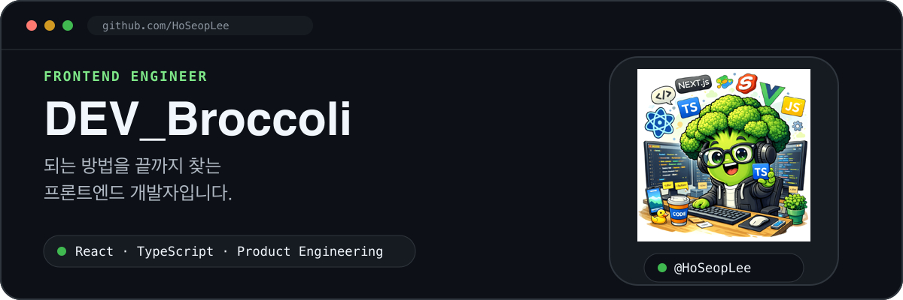

  

  <a href="https://note.hoseop.co.kr/">Portfolio</a> ·
  <a href="https://github.com/HoSeopLee">GitHub</a> ·
  <a href="mailto:llss2ssll@gmail.com">Email</a>

## 안녕하세요, 이호섭입니다

`DEV_Broccoli`, 개발하는 브로콜리라는 이름으로 React, Next.js, TypeScript를 중심으로 다양한 웹 서비스를 개발하고 있으며, 사용자 경험을 고려한 UI 구현과 인터랙션, 사용성 개선에 꾸준히 집중하고 있습니다. 문제를 깊이 있게 바라보고 끝까지 해결해 더 완성도 높은 결과를 만드는 개발자를 지향합니다.

## 경력

| 회사 | 기간 | 역할 및 기술 |
| --- | --- | --- |
| **SmartM2M** | **2022.10 — Present** | Frontend · React, Next.js, TypeScript, Electron |
| **Dmonster** | **2020.08 — 2022.10** | Frontend · React Native, React, Node.js |
| **FreshNTech** | **2019.07 — 2020.02** | Frontend · React, React Native |

## 기술 스택

#### Frontend & UI

  
  
  
  
  
  
  
  
  
  

#### State & Data

  
  
  
  

#### Visualization

  
  
  
  
  

#### Realtime & Platform

  
  
  
  

#### Backend & Infrastructure

  
  
  
  
  
  
  
  
  

#### Tooling & Delivery

  
  
  
  
  

## GitHub

  

