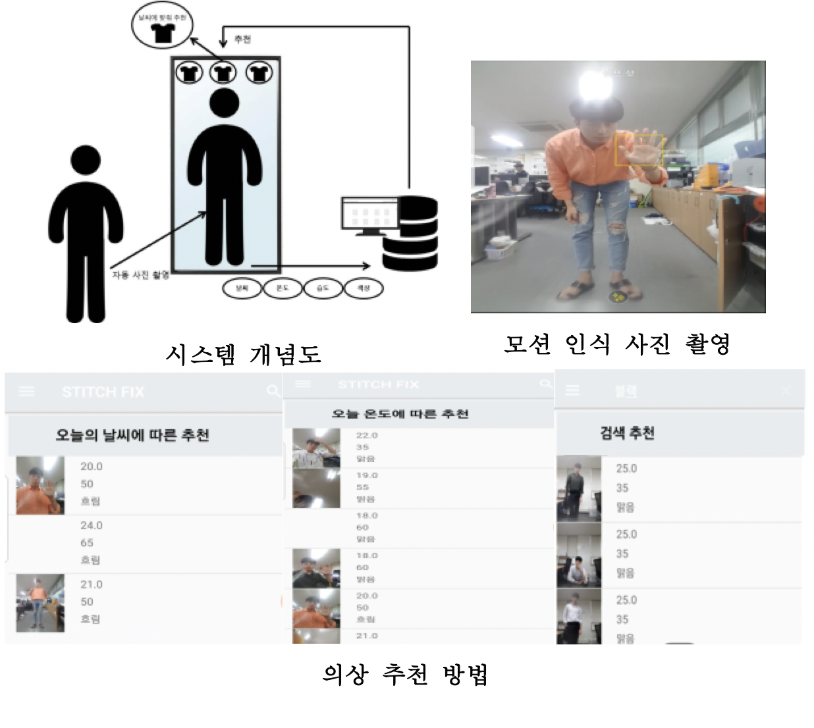
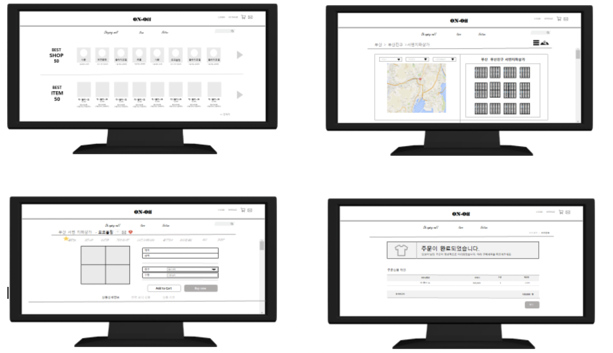
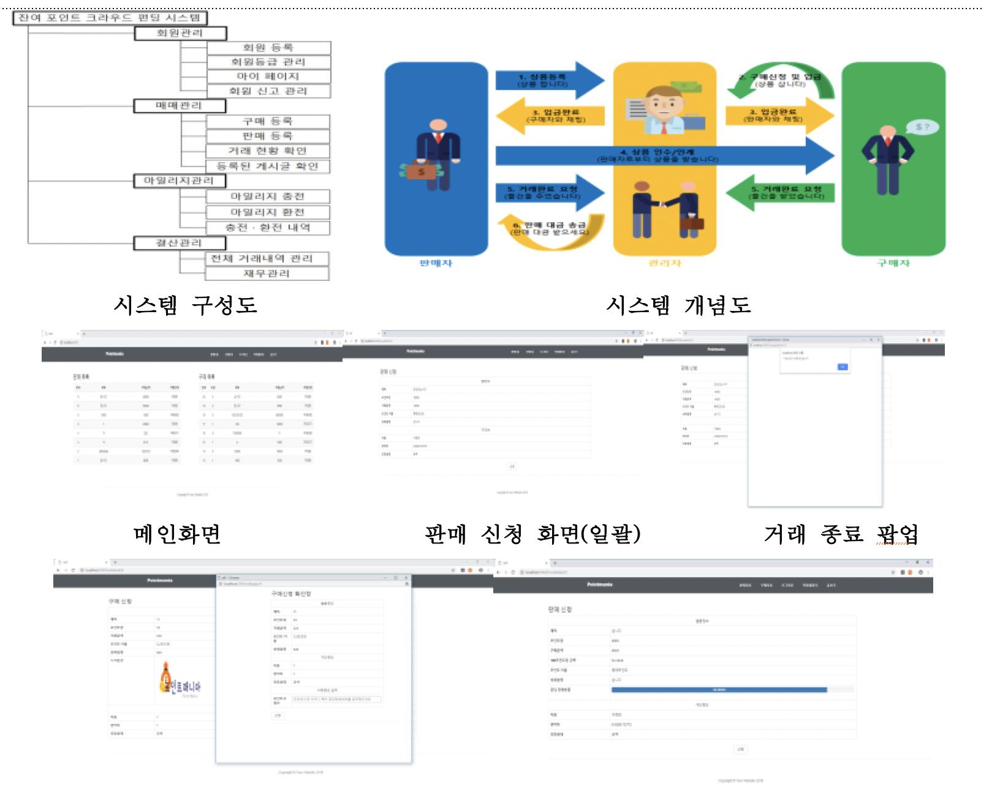
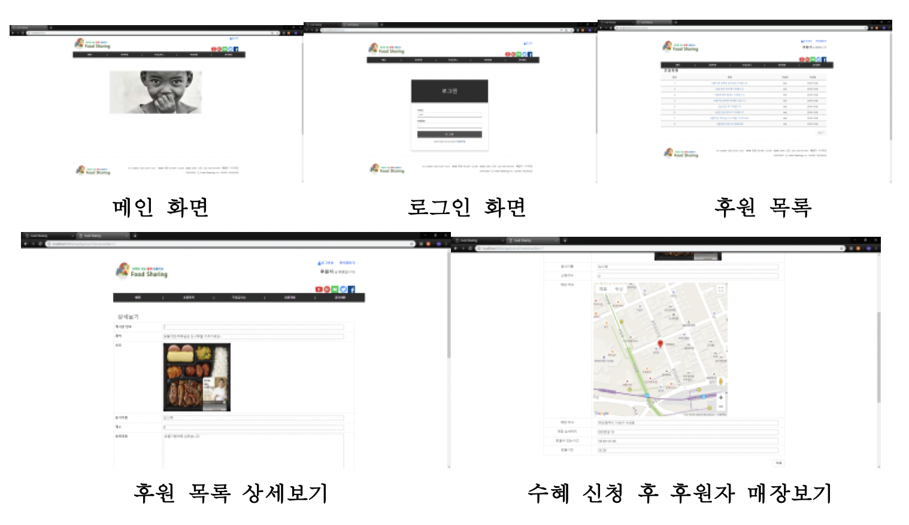
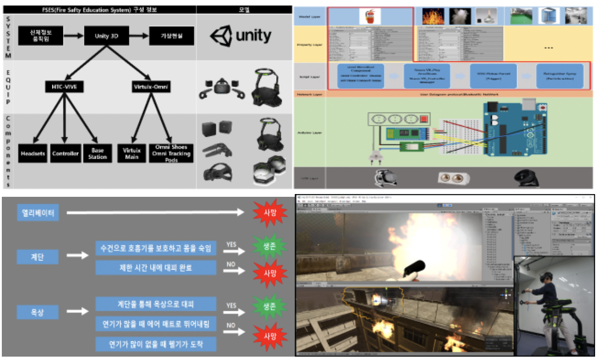
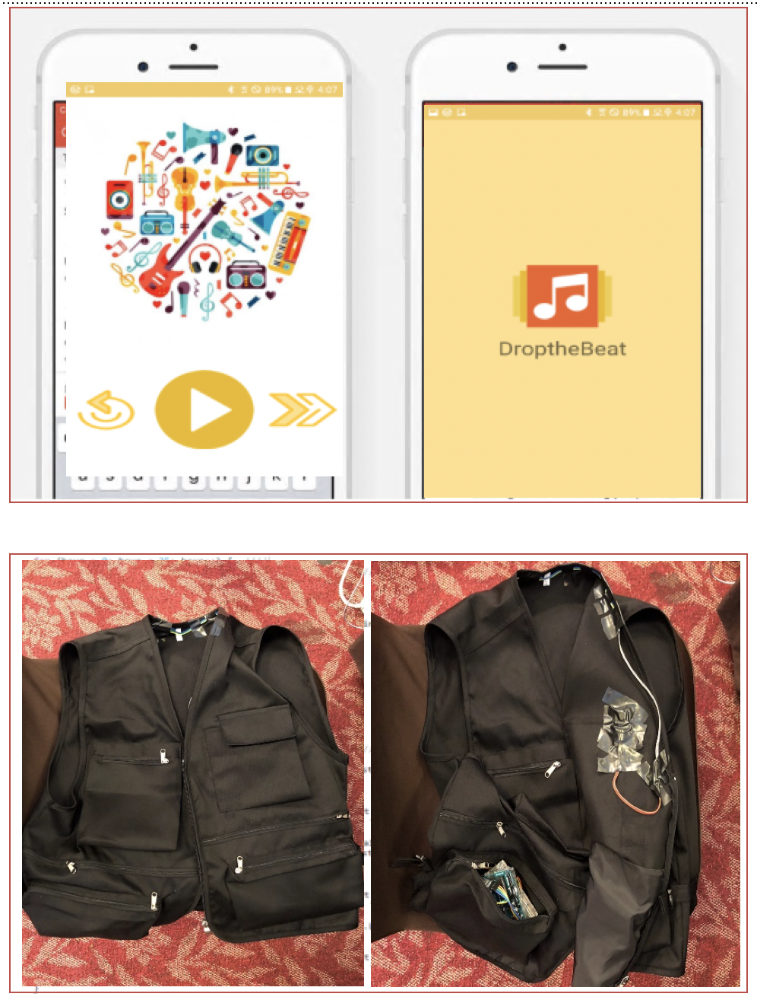
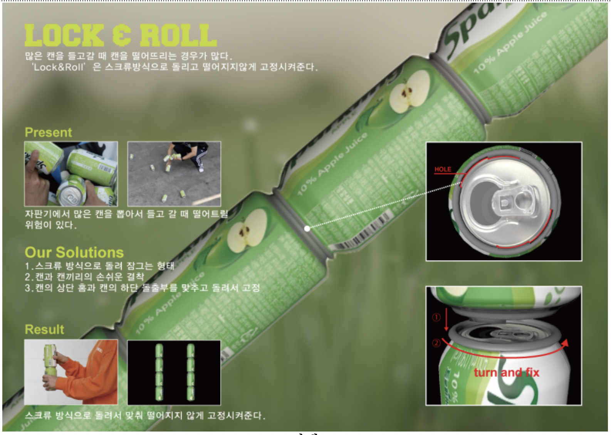
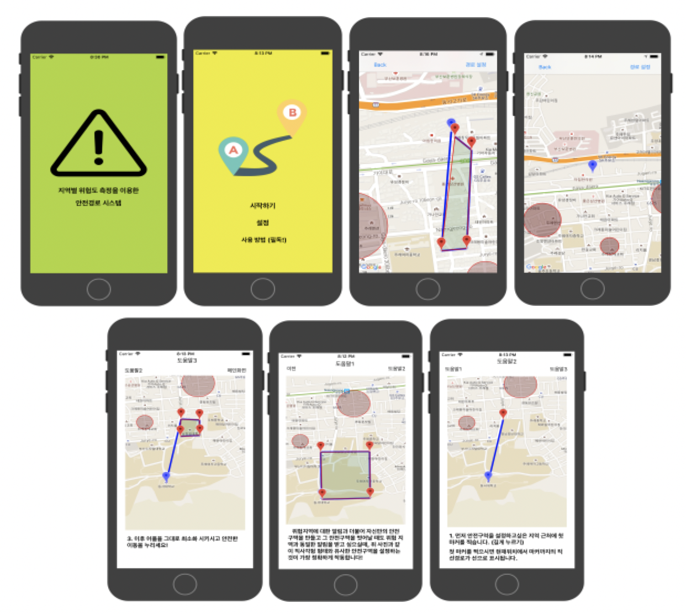
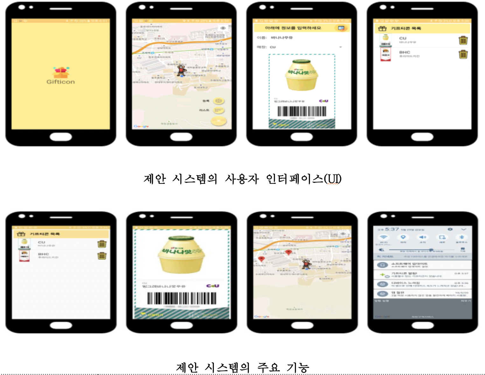

## 
Student

 

## 
4학년

 
<table border="1">
  <tr style="width:100%; ">
      <td align='center'style="width:25%;padding:1%;">스마트미러를 통한 사진기록기반 의상 추천 시스템</td>

  </tr>
  <tr style="width:100%; ">
      <td align='center'style="width:25%;padding:1%;">
        
        졸업 논문작성
      </td>

  </tr>
  <tr style="width:100%; ">
      <td align='center'style="width:25%;padding:1%;">Android Studio, php, mySQL</td>

  </tr>
</table>

</table>
 
 

## 
3학년

 
<table border="1">
  <tr style="width:100%; ">
      <td align='center'style="width:33%;padding:1%;">온오프라인 연계 쇼핑 시스템템</td>
      <td align='center'style="width:33%;padding:1%;">잔여 포인트 크라우드 펀딩 시스템</td>
      <td align='center'style="width:33%;padding:1%;">Food Sharing</td>
  </tr>
  <tr style="width:100%; ">
      <td align='center'style="width:33%;padding:1%;">
        
        &nbsp;
      </td>
        <td align='center'style="width:33%;padding:1%;">
        
        &nbsp;
      </td>
      <td align='center'style="width:33%;padding:1%;">
        
        상상프로젝트 장려상
      </td>
  </tr>
  <tr style="width:100%; ">
      <td align='center'style="width:25%;padding:1%;">
      UML 
        (프로젝트정의서, 요구사항 기술서, 클래스 분석서, UI 설계서, DB설계서)
      </td>
      <td align='center'style="width:25%;padding:1%;">
      node, ejs, JavaScript, mySQL, HTML, CSS</td>
      <td align='center'style="width:25%;padding:1%;">
      node, ejs, JavaScript, mySQL, HTML, CSS</td>
  </tr>
</table>

 
<table border="1">
  <tr style="width:100%; ">
      <td align='center'style="width:33%;padding:1%;">AVR을 이용한 소방안전 교육 시스템</td>
      <td align='center'style="width:33%;padding:1%;">청각장애인을 위한 비트조끼</td>
      <td align='center'style="width:33%;padding:1%;">Lock And Roll</td>
  </tr>
  <tr style="width:100%; ">
      <td align='center'style="width:33%;padding:1%;">
        
        2018 G-Star b2b040 전시 
        학부생 연구프로그램 URP 참여
      </td>
   <td align='center'style="width:33%;padding:1%;">
        
        교내 Development 콘테스트 장려상 
        &nbsp;
      </td>
        <td align='center'style="width:33%;padding:1%;">
        
       2018 RedDat Design Award Winner 수상  
      2018 교내 링크페어 우수상
      </td>

  </tr>
  <tr style="width:100%; ">
      <td align='center'style="width:33%;padding:1%;">Unity, Virtuix-Omni</td>
      <td align='center'style="width:33%;padding:1%;">
        Android Studio, Arduino
      </td>
      <td align='center'style="width:33%;padding:1%;">
      &nbsp;</td>

  </tr>
</table>

 
<table border="1">
  <tr style="width:100%; ">
      <td align='center'style="width:50%;padding:1%;">지역별 위험도 측정을 이용한 안전 경로 제공 시스템</td>
      <td align='center'style="width:50%;padding:1%;">Remember Gifticon</td>
  </tr>
  <tr style="width:100%; ">
      <td align='center'style="width:50%;padding:1%;">
        
       &nbsp;
      </td>
   <td align='center'style="width:50%;padding:1%;">
        
        KSCI 논문 투고
      </td>

  </tr>
  <tr style="width:100%; ">
      <td align='center'style="width:50%;padding:1%;">Swift, Google Map API</td>
      <td align='center'style="width:50%;padding:1%;">
        Android Studio, Google Map API, php, mySQL
      </td>
  </tr>
</table>

 
 

## 
2학년

 
<table border="1">
  <tr style="width:100%; ">
      <td align='center'style="width:33%;padding:1%;">온오프라인 연계 쇼핑 시스템템</td>
      <td align='center'style="width:33%;padding:1%;">잔여 포인트 크라우드 펀딩 시스템</td>
      <td align='center'style="width:33%;padding:1%;">Food Sharing</td>
  </tr>
  <tr style="width:100%; ">
      <td align='center'style="width:33%;padding:1%;">
        
        &nbsp;
      </td>
        <td align='center'style="width:33%;padding:1%;">
        
        &nbsp;
      </td>
      <td align='center'style="width:33%;padding:1%;">
        
        상상프로젝트 장려상
      </td>
  </tr>
  <tr style="width:100%; ">
      <td align='center'style="width:25%;padding:1%;">
      UML 
        (프로젝트정의서, 요구사항 기술서, 클래스 분석서, UI 설계서, DB설계서)
      </td>
      <td align='center'style="width:25%;padding:1%;">
      node, ejs, JavaScript, mySQL, HTML, CSS</td>
      <td align='center'style="width:25%;padding:1%;">
      node, ejs, JavaScript, mySQL, HTML, CSS</td>
  </tr>
</table>

 
<table border="1">
  <tr style="width:100%; ">
      <td align='center'style="width:33%;padding:1%;">AVR을 이용한 소방안전 교육 시스템</td>
      <td align='center'style="width:33%;padding:1%;">청각장애인을 위한 비트조끼</td>
      <td align='center'style="width:33%;padding:1%;">Lock And Roll</td>
  </tr>
  <tr style="width:100%; ">
      <td align='center'style="width:33%;padding:1%;">
        
        2018 G-Star b2b040 전시 
        학부생 연구프로그램 URP 참여
      </td>
   <td align='center'style="width:33%;padding:1%;">
        
        교내 Development 콘테스트 장려상 
        &nbsp;
      </td>
        <td align='center'style="width:33%;padding:1%;">
        
       2018 RedDat Design Award Winner 수상  
      2018 교내 링크페어 우수상
      </td>

  </tr>
  <tr style="width:100%; ">
      <td align='center'style="width:33%;padding:1%;">Unity, Virtuix-Omni</td>
      <td align='center'style="width:33%;padding:1%;">
        Android Studio, Arduino
      </td>
      <td align='center'style="width:33%;padding:1%;">
      &nbsp;</td>

  </tr>
</table>
